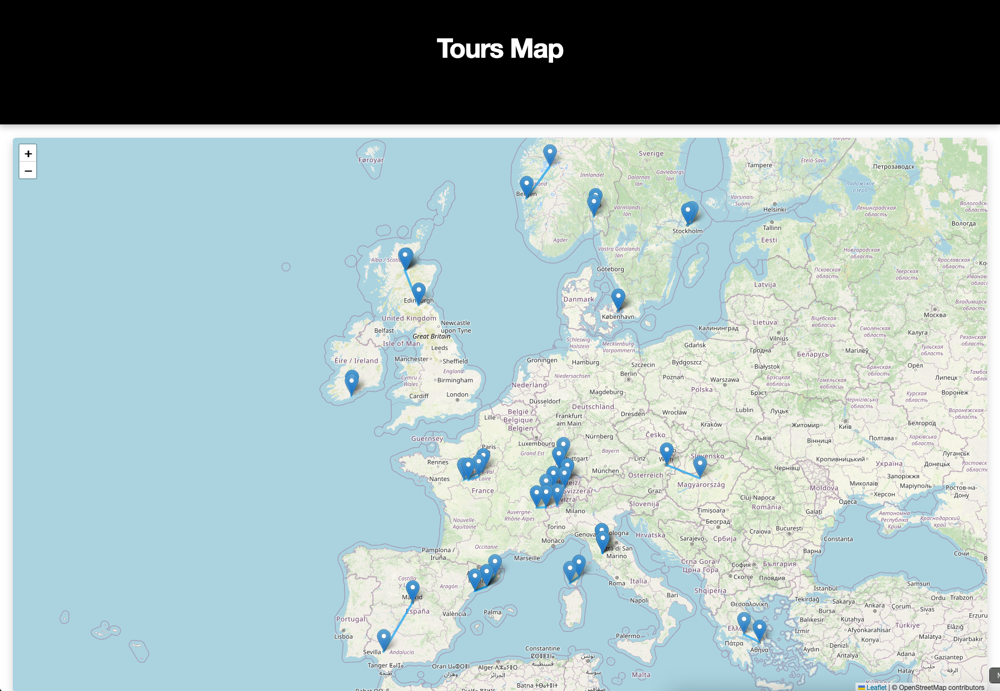
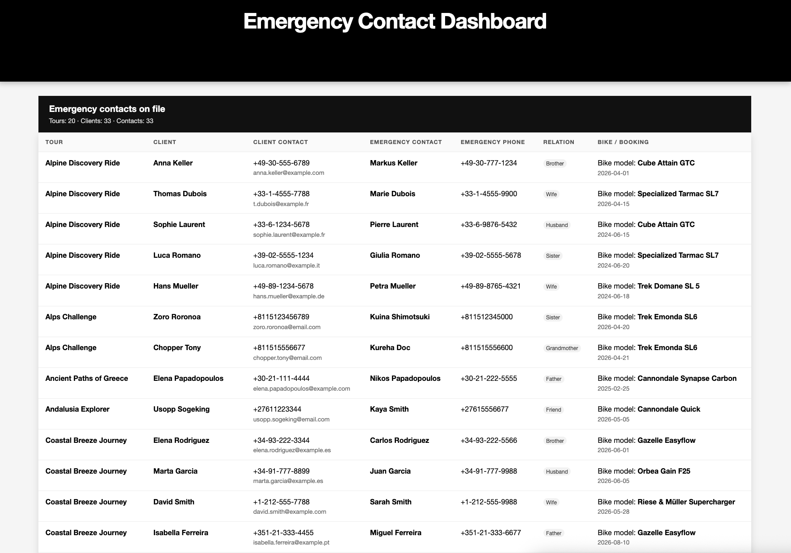
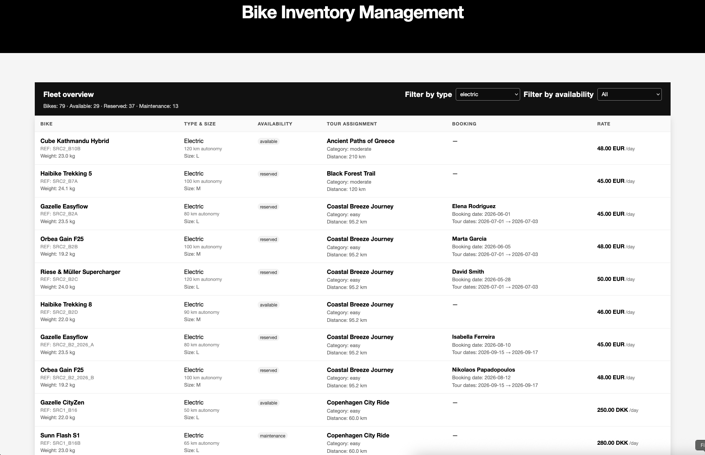
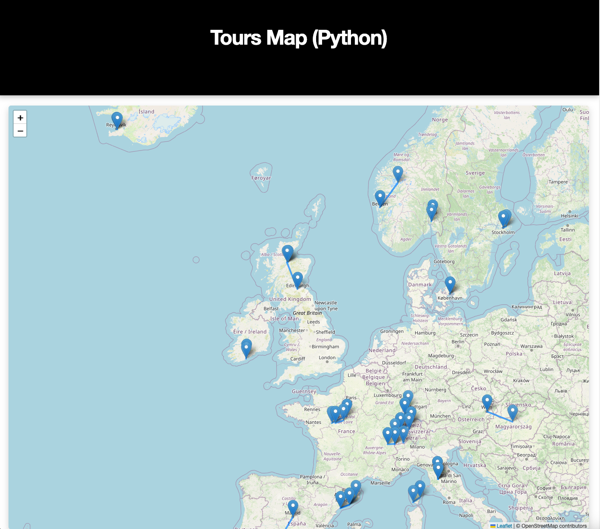

# Data Pipeline 1

---

## Context

This project focuses on designing and implementing an XML-based database platform for a **cycling tour operator**. The system will integrate and manage diverse entities—such as destinations, cycling paths, rental bikes, activities and events, tour packages, bookings, clients, and guides—to ensure efficient coordination and streamlined access to information. The project will cover:

- data modeling and management: Structuring and maintaining information about all entities and their relationships.
- user-oriented functionalities exploiting the database and supporting various user needs, such as searching for cycling paths and tour offers, booking trips, renting bikes, scheduling and managing trip groups, maintaining the bike rental fleet, etc.

The platform will showcase effective exploitation of XML technologies for real-world tourism and logistics management.

## To-Do List

See [TODO.md](TODO.md#tasks-checklist) for the tasks checklist.

## Deliverables

See [TODO.md](TODO.md#deliverables-checklist) for the deliverables checklist.

## Evaluation

You will be evaluated according to the **quality and richness of your modeling** (modular schema, fine grained type definitions and constraints), the **quality and richness of the addressed scenarios/use cases/functionalities**, the **quality of your stylesheets** (prefer a recursive XSL programming style that extensively uses XPath), the quality of your Java and Python codes, and the quality of your report showing your **ability to take a step back**.

---

## XSLT Set up Instructions

### Java Libraries for XSLT Transformations

From the project root:

```shell
mkdir libs && cd libs

curl -Lo saxon-he-12.4.jar https://repo1.maven.org/maven2/net/sf/saxon/Saxon-HE/12.4/Saxon-HE-12.4.jar
curl -Lo xmlresolver-5.1.1.jar https://repo1.maven.org/maven2/org/xmlresolver/xmlresolver/5.1.1/xmlresolver-5.1.1.jar
```

## Running XSLT Transformations

From the project root.

For the following commands to run XSTL transformations, please note:

```
-s: specifies the source XML file
-xsl: specifies the XSLT stylesheet
-o: specifies the output HTML file
```

On Mac/Linux, use `:` to separate classpath entries.
On Windows, use `;` instead.

---

### Scenario 1: List of all tours to HTML

Run an XSLT transformation using the following command to get the HTML outputs for the tours depending on the dataset:

```shell
java -cp libs/saxon-he-12.4.jar:libs/xmlresolver-5.1.1.jar net.sf.saxon.Transform \
  -s:dataset/merged_datasets.xml \
  -xsl:xsl/01_tours_to_html.xsl \
  -o:outputs/html/01_tours.html
```

Output Example: `outputs/html/01_tours.html`


---

### Scenario 2: List of all guides to HTML

Run the following commands to get the HTML outputs for the guides for both of the dataset:

```shell
java -cp libs/saxon-he-12.4.jar:libs/xmlresolver-5.1.1.jar net.sf.saxon.Transform \
  -s:dataset/merged_datasets.xml -xsl:xsl/02_guides_to_html.xsl -o:outputs/html/02_guides.html
  ```

Output Example: `outputs/html/02_guides.html`


---

### Scenario 3: Spanish-speaking guides to HTML

You can also run the following commands to get the HTML outputs for the spanish-speaking guides for both of the dataset:

```shell
java -cp libs/saxon-he-12.4.jar:libs/xmlresolver-5.1.1.jar net.sf.saxon.Transform \
  -s:dataset/merged_datasets.xml \
  -xsl:xsl/03_guides_filtered_by_language_to_html.xsl \
  -o:outputs/html/03_spanish_speaking_guides.html \
  lang=Spanish
```
You can change the lang parameter to any language you want ('French', 'German', 'Italian', etc.)

Output Example: `outputs/html/03_spanish_speaking_guides.html`


---

### Scenario 4: Interactive map of tour locations

You can also run the following commands to get the HTML outputs for the interactive map of tour locations for both of the dataset:

```shell
java -cp "libs/saxon-he-12.4.jar:libs/xmlresolver-5.1.1.jar" net.sf.saxon.Transform \
 -s:dataset/merged_datasets.xml -xsl:xsl/04_tours_map_to_html.xsl -o:outputs/html/04_tours_map.html
```

Output Example: `outputs/html/04_tours_map.html`



---

### Scenario 5: Emergency Contact Dashboard

You can also run the following commands to get the HTML outputs for the emergency contact dashboard for both of the dataset:

```shell
java -cp libs/saxon-he-12.4.jar:libs/xmlresolver-5.1.1.jar net.sf.saxon.Transform \
 -s:dataset/merged_datasets.xml \
 -xsl:xsl/05_emergency_contacts_to_html.xsl \
 -o:outputs/html/05_emergency_contacts.html
 ```

Output Example: `outputs/html/05_emergency_contacts.html`



---

### Scenario 6:  Bike Inventory Management Dashboard

Command to generate the bike inventory management dashboard in HTML format:

```shell
java -cp libs/saxon-he-12.4.jar:libs/xmlresolver-5.1.1.jar \
  net.sf.saxon.Transform \
  -s:dataset/merged_datasets.xml \
  -xsl:xsl/06_bikes_inventory_to_html.xsl \
  -o:outputs/html/06_bikes_inventory.html
 ```

Output Example: `outputs/html/06_bikes_inventory.html`



---

### Scenario 7: Business analysis in JSON

```shell
java -cp libs/saxon-he-12.4.jar:libs/xmlresolver-5.1.1.jar \
  net.sf.saxon.Transform \
  -s:dataset/merged_datasets.xml \
  -xsl:xsl/07_business_analysis_to_json.xsl \
  -o:outputs/json/07_business_analysis.json
 ```

Output Example: `outputs/json/07_business_analysis.json`

---

### Scenario 8: Operational analysis in JSON

```shell
java -cp libs/saxon-he-12.4.jar:libs/xmlresolver-5.1.1.jar \
  net.sf.saxon.Transform \
  -s:dataset/merged_datasets.xml \
  -xsl:xsl/08_operational_analysis_to_json.xsl \
  -o:outputs/json/08_operational_analysis.json
 ```

Output Example: `outputs/json/08_operational_analysis.json`

---

### Scenario 9: Datasets merge

You can add as many datasets as source-files as you want, you just need to be precise with the path.

Command to generate the merged dataset in the outputs folder:
```shell
java -cp libs/saxon-he-12.4.jar:libs/xmlresolver-5.1.1.jar \
  net.sf.saxon.Transform \
  -xsl:xsl/09_merge_datasets_to_xml.xsl \
  -o:outputs/xml/09_merged_datasets.xml \
  -it:main \
  'source-files=../dataset/sub_datasets/dataset_1.xml ../dataset/sub_datasets/dataset_2.xml ../dataset/sub_datasets/dataset_3.xml ../dataset/sub_datasets/dataset_4.xml'
 ```

Output Example: `outputs/xml/09_merged_datasets.xml`

Command to generate the merged dataset in the dataset folder:

```shell
java -cp libs/saxon-he-12.4.jar:libs/xmlresolver-5.1.1.jar \
  net.sf.saxon.Transform \
  -xsl:xsl/09_merge_datasets_to_xml.xsl \
  -o:dataset/merged_datasets.xml \
  -it:main \
  'source-files=../dataset/sub_datasets/dataset_1.xml ../dataset/sub_datasets/dataset_2.xml ../dataset/sub_datasets/dataset_3.xml ../dataset/sub_datasets/dataset_4.xml'
 ```

Output: `dataset/merged_datasets.xml`

---

### Scenario 10: Anonimized dataset

```shell
java -cp libs/saxon-he-12.4.jar:libs/xmlresolver-5.1.1.jar \
  net.sf.saxon.Transform \
  -s:dataset/merged_datasets.xml \
  -xsl:xsl/10_data_anonymization_to_xml.xsl \
  -o:outputs/xml/10_anonymized_data.xml
 ```

Output Example: `outputs/xml/10_anonymized_data.xml`

---

## Python Set up Instructions

**Python version used:**
- Python 3.14.0

Install requirements from `requirements.txt`:

```shell
pip install -r requirements.txt
```

**VS Code Extensions & Configuration**
- Blackformatter (Formatter)
- Flake8 (Linter)

For Flake8, in your VS Code workspace settings (.vscode/settings.json), set:

```json
{
  "python.linting.flake8Args": [
    "--config=.flake8"
  ]
}
```

### Running Python Pipeline script

From the project root, run the following commands to launch a CLI program to validate and transform XML data using the selected XSLT stylesheets:

```shell
python python/11_validate_and_transform.py
```

Output Example: `outputs/html/11_guides_py.html`


### Run a scenario with a Python script: generate_tours_map.py

From root directory, run the following command to generate an HTML map of tour locations using the Python script:

```shell
python python/12_generate_tours_map.py \
  --xml dataset/merged_datasets.xml \
  --out outputs/html/12_tours_map_py.html
```
Output Example: `outputs/html/12_tours_map_py.html`



